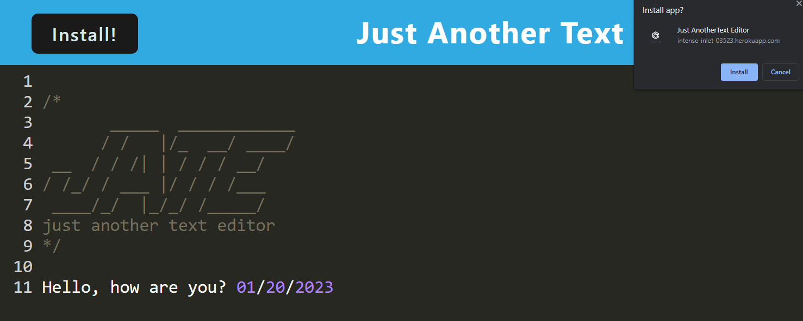
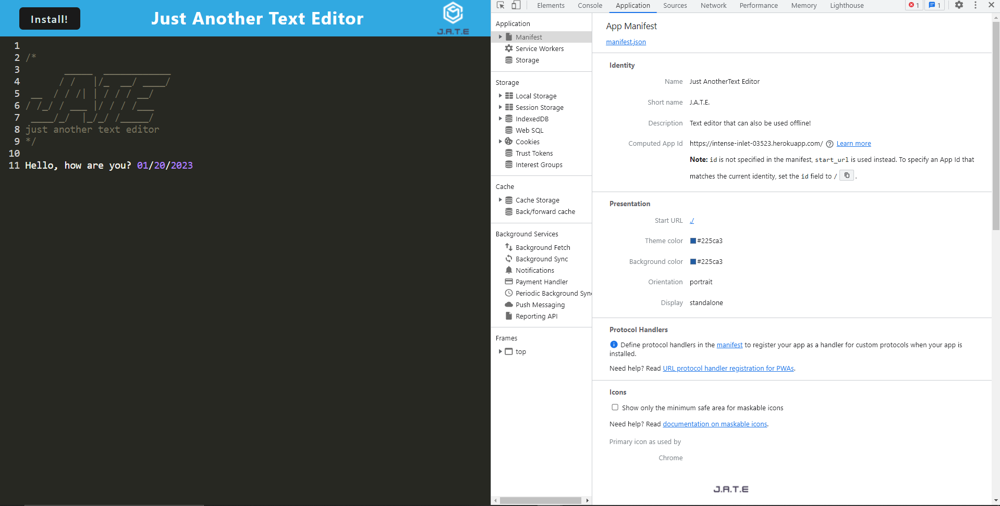
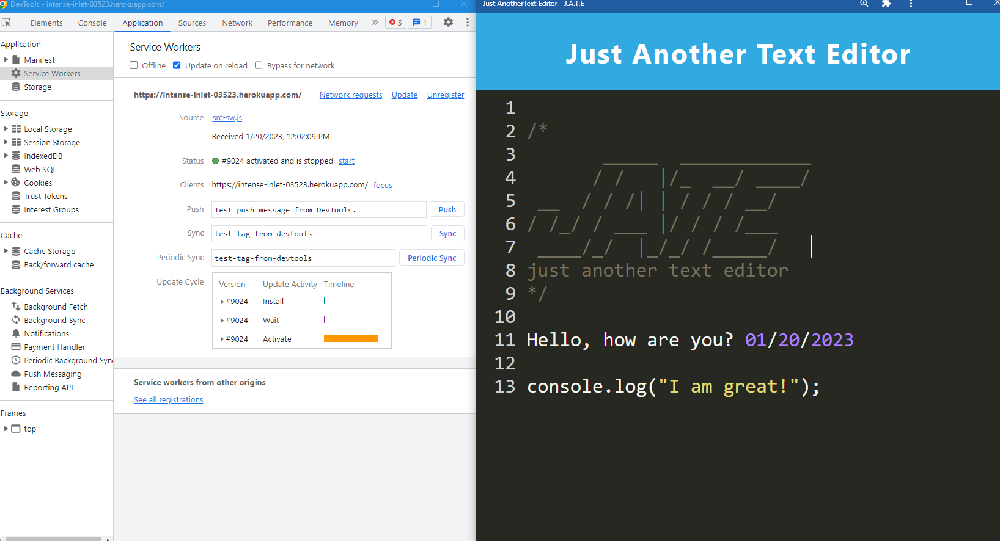
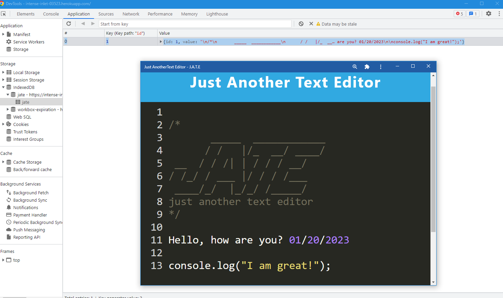

# <J.A.T.E - Just Another Text Editor!>

## Description

  Just Another Text Editor or JATE for short, is a text editor that was created through PWA, using service workers and webpacks. For this app, you can start typing anywhere and it will save automatically. You can also download this app to use for offline mode.

## User Stories

- Users are able to download this app from their browser and it offline.app.  
- Users can input text into the app. 
- Their data persists while they are offline as well.

## Installation

- Clone this repository.
- cd PWA-Text-Editor/ 

Dependencies:
- Open terminal: 
   - npm install

To start server:
  - npm run start:dev

## Usage

Provide instructions and examples for use. Include screenshots as needed.

To add a screenshot, create an `assets/images` folder in your repository and upload your screenshot to it. Then, using the relative filepath, add it to your README using the following syntax:

 

## Contributers

- Bryant Trinh

## License

No license

## How to Contribute

- Anyone can contribute!
